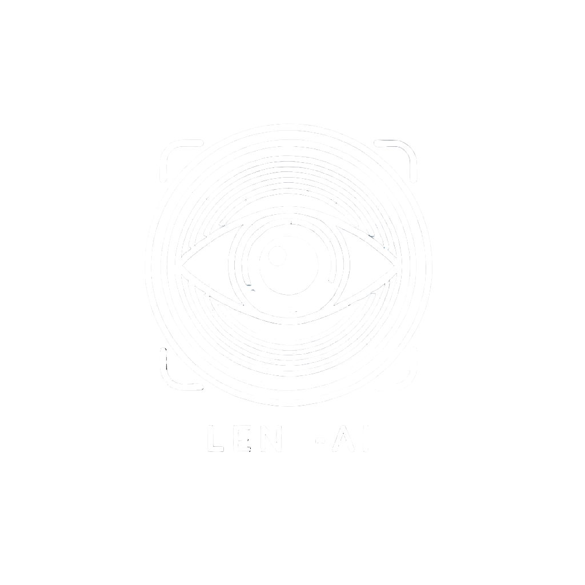

# 🌟 Lens-AI - Inteligência Visual Aprimorada  

  

🚀 **Lens-AI** é um aplicativo de **visão computacional** que utiliza **inteligência artificial** para reconhecer e interpretar objetos, textos e códigos visuais. Inspirado no **Google Lens** e **GPT-4o Plus**, ele oferece funcionalidades inovadoras para consumidores e estudantes.  

---

## 📌 Funcionalidades  

✅ **Captura e análise de imagens** - Reconheça objetos, textos e produtos rapidamente.  
✅ **Comparação de preços** - Veja preços e histórico de valores de produtos.  
✅ **Histórico de consultas** - Acesse pesquisas anteriores facilmente.  

---

## 📦 Tecnologias Utilizadas  

🔹 **Frontend:** React Native + Expo  
🔹 **Backend:** Node.js 
🔹 **Banco de Dados:** *** 
🔹 **Inteligência Artificial:** Ollama
🔹 **Autenticação:** ***

---

## 🚀 Como Instalar e Rodar o Projeto  

### **Pré-requisitos**  
Antes de começar, certifique-se de ter instalado:  
- [Node.js](https://nodejs.org/)  
- [Expo CLI](https://docs.expo.dev/get-started/installation/)  
